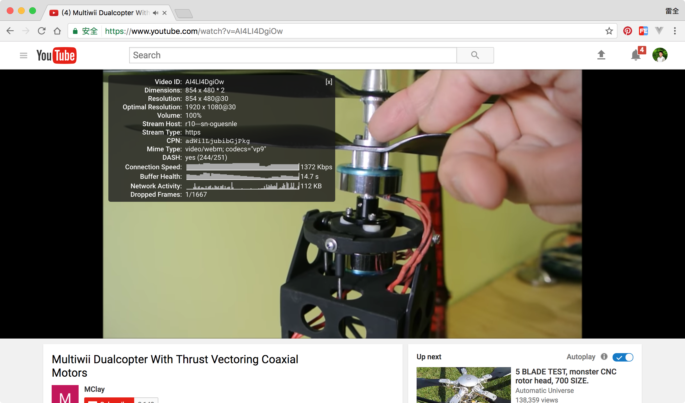
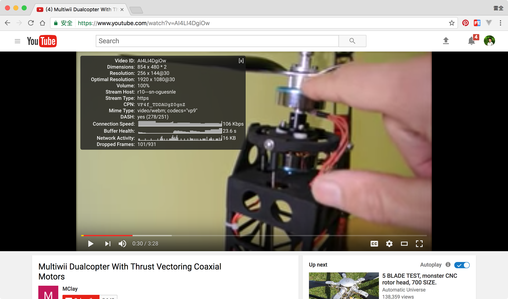

我们都知道：天朝，是个神奇的地方。

在这里，领导人讲句话都是要认真学习的；在这里，有个叫做谷歌的网站从来都上不去；在这里，大家都是要为了某项事业奋斗终身的；在这里，我们知道有个看不见摸不着的东西叫做“墙”。

然而，做一头被围在墙里的困兽，总是让人心有不甘的。

<!--more-->

我好几年前开始翻墙：从开始的PPTP，到后来的Shadowsocks。现在在Shadowsocks技术之上，又有各种新花样，我没时间一一去实践，等被屏蔽了再说吧。在我看来，翻墙技术的发展历史，就是一部广大人民为了自由与强权作斗争的抗争史。这部历史波澜壮阔，涌现出广大可歌可泣的英雄人物；这部历史耻辱肮脏，喝茶、屏蔽、干扰都是圈子里屡见不鲜的事情。

在我的PPTP被屏蔽的时候，我实在忍无可忍选择了Shadowsocks。Shadowsocks是一个专门针对“墙”的技术，简单、方便、快速、安全、抗干扰能力强，我很喜欢它，至今热爱它，也对其被请喝茶的作者充满敬仰与感激。

然而，好景不长，现在Shadowsocks是越来越慢了。不是因为被屏蔽，因为其属于端到端的加密技术目前还是没被攻破的，不过估计也快了；相反的是，因为被压抑的人民实在太多了，大家都认识到了这项技术的优越性，都来使用它。结局就是：全世界任何地方的服务器中心，尤其是距离大中华地区近的，只要有访问速度快的机器，都会被抢光。这不仅让一般的开发者有时候机器都抢不到，更让原本狭窄的国际带宽，慢上加慢。更有甚者，有不良开发者，为了提高自己机器的访问速度，强行使用速锐等加速软件，损人利己，令国际带宽更加缓慢。

终于，谷歌推出了TCP BBR 拥塞控制算法，加速效果很好，于是我部署到了自己的一台服务器上。

谷歌大法好。

测试效果如下：





其实，从三张图我们可以看出来，翻墙速度慢的主要问题就是国际宽带有限：午夜时刻使用的人少，不用开启就很快；白天尤其是晚上，则线路拥堵，此时BBR是能够显著提高速度的。

我们来看下如何安装和使用BBR。

#### 服务器环境：ubuntu 14.10 X64

#### 1.升级Linux内核到4.9或以上：
因为BBR集成到了内核4.9中，那我们安装即可。我们在ubuntu网站找到[下载地址](http://kernel.ubuntu.com/~kernel-ppa/mainline)，下载必须的文件，我下载的是4.10.12版本内核。
```bash
wget http://kernel.ubuntu.com/~kernel-ppa/mainline/v4.10.12/linux-headers-4.10.12-041012_4.10.12-041012.201704210512_all.deb
wget http://kernel.ubuntu.com/~kernel-ppa/mainline/v4.10.12/linux-headers-4.10.12-041012-generic_4.10.12-041012.201704210512_amd64.deb
wget http://kernel.ubuntu.com/~kernel-ppa/mainline/v4.10.12/linux-image-4.10.12-041012-generic_4.10.12-041012.201704210512_amd64.deb
```

#### 2.卸载旧内核：

查询目前安装的内核：
```bash
dpkg -l | grep linux-image
```

卸载，有多个的话全部卸载：
```bash
apt remove linux-image-3.13.0-112-generic
```

#### 3.安装内核：
```bash
dpkg -i *.deb
```

#### 4.更新启动向导：
```bash
update-grub
```

#### 5.确认最新内核安装情况：
```bash
ls /boot/vmlinuz*
```

#### 6.重启机器：
```bash
reboot
```

### 7.重启后验证内核版本：
```bash
uname -a
```
我的输出为：
```bash
Linux leiquan.website 4.10.12-041012-generic #201704210512 SMP Fri Apr 21 09:14:40 UTC 2017 x86_64 x86_64 x86_64 GNU/Linux
```

#### 8.开启BBR：
（1）修改内核参数：

```bash
vim /etc/sysctl.conf
```

在文件头添加：

```bash
net.core.default_qdisc=fq
net.ipv4.tcp_congestion_control=bbr
```

保存生效，执行：
```bash
sysctl -p
```
检查：
```bash
sysctl net.ipv4.tcp_available_congestion_control
sysctl net.ipv4.tcp_congestion_control
```

如果结果都有bbr, 则证明你的内核已开启bbr。

查看：

```bash
lsmod | grep bbr
```

看到有 tcp_bbr 模块即说明bbr已启动。

虽然现在可以更加欢快的翻墙，然而还是不明白为什么要在我们和世界面前竖起高墙。

#### 参考资料：
1.[速锐开源破解版：serverspeeder](https://github.com/91yun/serverspeeder)

2.[Linux Kernel 4.9 中的 BBR 算法与之前的 TCP 拥塞控制相比有什么优势？](https://www.zhihu.com/question/53559433)

3.[BBR Github项目地址](https://github.com/google/bbr/)
