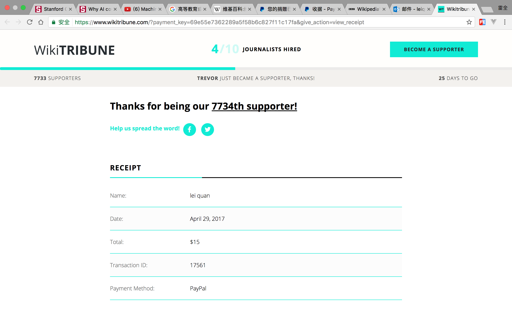

之前，我有一篇文章《[震惊！第一次被侵权竟然是因为这个！](https://leiquan.website/2017/04/24/%E9%9C%87%E6%83%8A%EF%BC%81%E7%AC%AC%E4%B8%80%E6%AC%A1%E8%A2%AB%E4%BE%B5%E6%9D%83%E7%AB%9F%E7%84%B6%E6%98%AF%E5%9B%A0%E4%B8%BA%E8%BF%99%E4%B8%AA%EF%BC%81/)》，讲到了开源精神；今天，看到了WikiTRIBUNE的消息，觉得是个很好的项目。想总结下维基百科、维基解密、维基学院、维基新闻等项目所体现出来的维基精神，另外提出我之前一直有过的一个关于“维基蓝图”的想法。

<!--more-->

[维基百科](https://www.wikipedia.org/)，自由的百科全书！维基百科是一个开放、自由、人人可编辑的百科平台，也是我们大多数人都熟知的平台。因为其自由的特性，人人都可以编辑，因而从某种程度上，杜绝了一个词条被官方解释、被某种偏见者或倾向者解释、利益相关者解释的时候所携带的意识形态、立场利益、不公允的价值趋向的影响。正是因为客观公正，开放透明，所以维基百科的信誉度和可信度，整体而言是非常高的。

[维基解密](https://wikileaks.org/)，（又称维基揭密或维基泄密），是透过协助知情人让组织、企业、政府在阳光下运作的、无国界非盈利的互联网媒体。这个国际性非营利媒体组织，专门公开来自匿名来源和网络泄露的文档。该网站已经泄露了多份机密文件，主要集中于政治贪腐方面的爆料，多次成功的引领国际新闻头条，甚至影响了美国大选[1]。

[维基学院](https://www.wikiversity.org/)，这个项目，目前中文版是beta版本，因而不为人熟知，截至目前（2017-04-29），英文版本有23000以上的学习资源，其学习资源涵盖：计算机程序开发、多媒体编辑、物理、化学、音乐、美术、数学、生物等等领域，资源还是比较全面的，但是课程内容有限，比较简短，在某些领域的学习条目仅仅列出了学习的资源索引。这是可以理解的，毕竟维基基金会全部收入来源于捐赠，为了中立客观拒绝了广告收入，所有资源的更新也源于志愿者的贡献。

[维基教科书](https://en.wikibooks.org/)，此计划收集自由的教科书，并让用户自己编辑书。维基教科书中一部分书来自网络上已完成编写的内容开放的教科书，贡献必须确定是版权已被作者放弃或确定内容永远是自由于公有领域的Copyleft许可证下发布，网站内所有内容皆在GNU自由文档许可证下发布。目前项目中的一些书籍已经完成，一些即将完成，很多书籍提供PDF版本下载。

[维基新闻](https://www.wikinews.org/)这个项目，旨在打造一个公正客观、来源明确的中立新闻网站，也有[中文](https://zh.wikinews.org/wiki/Wikinews:%E9%A6%96%E9%A1%B5)网站。截至目前（2017-04-29），英文语言种类下新闻数量（21000）最多，中文内容不够多（6000），新闻篇幅大多简短，清晰，目前主要是港台记者和作者写作。

此外，维基媒体基金会下面还有其他的[几个项目](https://zh.wikipedia.org/wiki/%E7%BB%B4%E5%9F%BA%E5%AA%92%E4%BD%93%E5%9F%BA%E9%87%91%E4%BC%9A#.E7.BB.B4.E5.9F.BA.E5.AA.92.E4.BD.93.E8.AE.A1.E5.88.92)：[维基物种](https://species.wikimedia.org/)，[维基数据](https://www.wikidata.org/)，[维基共享资源](https://commons.wikimedia.org/)，[维基语录](https://commons.wikimedia.org/)，[维基导游](https://www.wikivoyage.org/)，[维基文库](https://www.wikisource.org/)，[维基词典](https://www.wiktionary.org/)。

然而就在前几天，[Wikitribune](https://www.wikitribune.com/)（港媒翻译为：维基论坛报）这个项目上线了，此项目不属于维基媒体基金会，而是维基百科创始人吉米·威尔士的独立项目。根据他的说法：“Wikitribune的新闻来自人民，且为了人民”，目的是提供“事实和中立”的文章，以打击“假新闻”问题。其项目资金来源于普通捐赠者，没有广告收入，可雇用的记者人数取决于非营利组织的资金水平，资金众筹于2017年4月25日开始，支持者可选择每月支付10英镑或15美元。这些消息的获取，对所有人来说都是免费的。记者将需要提供事实来源，或者提供完整的访谈记录和文字稿。大众用户将能够修改以及更改文章，但是更改须经适格人士批准才会生效。网站不设股东、广告客户以及付费订阅才能阅读的内容，这些措施有助于减少新闻面临的商业压力。付费用户有权建议新闻主题。

在评论这个项目之前，我们先看下[维基精神](https://zh.wikipedia.org/wiki/Wikipedia:%E7%B6%AD%E5%9F%BA%E7%B2%BE%E7%A5%9E)。结合维基的其他几个项目，我认为简而言之维基精神就是：自由公开（人人可参与阅读或者贡献），开放透明（修改过程可见)，中立公正（不接受商业赞助）。

而其背后的维基基金会作为一个典型的新型公益机构，我认为是历史时代性的。人类社会从无组织的松散部落中，发展出了国家机构；在国家机构下，公民能够有序协作，进而社会快速发展，后来发展出来公司和企业；公司企业不断创新，不断开拓市场，直接促进了经济全球化、进而促进政治全球化、文化全球化。

然而，国家机构和公司企业，各自代表了其利益：国家机构的统治特权，公司企业的商业利益。因而，这两类机构，都是属于有利可图者。

维基基金会，正是看到了这种有利可图者背后所代表的利益，因而拒绝商业赞助（国家和正当也能利用商业赞助）。维基基金会只接受普通人的匿名赞助，因而代表的是谁呢？自然是这些普通的赞助者，你我他，人民，全世界的人民。而Wikitribune的诞生，其创始人表示，新闻来自人民，且为了人民，就是最好的体现。

这就像我在社会主义上没看到的真正代表人民的制度和机构，在维基上看到了；就像没实现的无需所有权，按需分配的共产主义，我在摩拜单车上仿佛看到了。一个理论家对未来的预测，或许终究抵不过技术发展所带来的改变，马克思或许没有想到互联网这样的东西会诞生。

因而我是极其支持这个项目的，毕竟古今中外，假新闻成风也不是什么奇怪的事情。这里需要注意的是，假新闻并不仅仅指代与真实事实截然相反的报道，也包括明显的偏离事实诱导性新闻，试图掩盖事实的片面性新闻，转义矛盾的替代性新闻，我想大概都可以归于此类。Wikitribune的创立原因之一就是抨击特朗普的假新闻。

下图是我认为最好的评论：

最后，说一下我自己很久一来的一个设想，我把它称作“维基蓝图”，主要想法是在一个地方集中关于社会的未来发展的各路社会学家、思想家、经济学家、法学家、心理学家、人类学家等以及他们的理论。

出生在90年代的中国，我的教育收到了很多关于意识形态斗争的东西，我不知道历史终将证明哪一条路会是对的，但是我已经受够了。我觉得，在以前，社会学家、经济学家、法学家，他们的主要战场在自我的著作，后来，论文体系的建立让他们一部分转移到了期刊，还是以个人著作为主。这些人的作品，有很多会对后来的社会走向产生重大影响，比如经济学家凯恩斯，比如马克思。对社会发展可能有重大影响的，不仅是科技，社会科学的各个方面也影响深远。或许新技术比如互联网的出现，能让这些社会科学家转移到新的战场。我们欣赏、支持维基的协作方式和其价值理念，如果有类似的维基论坛让这些社会科学家和学者有足够的地方讨论、交流其思想，发表其学术著作，我想会加快其进程，从而促进社会的发展；持不同学说的学者之间的交流，或许会有很多争论，然而百家争鸣的局面总是好的，也能促进其各自理论的完善。

目前这个想法并没有具体的产品形态，只是一个设想，但是我认为或许是一个值得仔细研究和向维基基金会提出建议的设想。以后会对其做出详细说明，作为建议提交给维基基金会。

---
#### 参考资料：
[1] [维基解密（WikiLeaks）是怎么影响美国大选的----凤凰青年](http://young.ifeng.com/a/20161101/44482680_0.shtml)

[2][Wikipedia's Jimmy Wales creates news service Wikitribune](http://www.bbc.com/news/technology-39695767)
