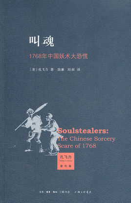

这几天有事，无心也无法学习，边把《叫魂·1768年中国妖术大恐慌》这本书读了，觉得还不错，也发现了一些有趣的现象，引发了对现实社会中的一些思考。

<!--more-->

首先，用自己的语言简要整理了下叫魂事情的来龙去脉，也就是叫魂案的发生，发展，高潮和结局。

#### 开始阶段

第一阶段，恐慌开始，然后被压制。

1768年初春，丝绸之乡德清的慈相寺的和尚，因为嫉妒附近观音庙的香火，把吴东明的竞争对手塑造成埋丧的邪恶之人，诱骗恐惧的民众去德清寺进香。（按作者说法此时叫魂已经开始：时下人们对叫魂的恐惧【第229页】）

1768年2月，倍受侄儿欺负的农夫沈士良得知石匠吴东明可以叫魂。

1768年3月25日，穆方舟为了领赏栽赃吴东明的副手郭亭秀叫魂，后被揭穿。

1768年3月26日，吴东明回乡买米的时候听到沈士良的事，而后为了避免被扯进叫魂，将沈士良扭送到德清县衙。

1768年4月3日，计兆美在杭州流浪因为口音被抓，在严刑逼供下承认叫魂，并栽赃给吴东明，后栽赃被揭露；而后，县衙公开质询，让沈士良，慕方舟，计兆美游行示众，以止留言，然而留言不止。

1768年4月8日，四和尚：巨成、正一、静心、超凡中的巨成和静心，因为询问小孩的名字被村民怀疑扭送官府。而后超凡和正一被上级下令拘捕游方僧人【第15页】的蔡瑞拘捕，后蔡瑞招供，由于向和尚索要规矩钱不成而陷害。同日，萧山的一位白铁匠因为被怀疑叫魂而打死。

1768年5月3日，乞丐秋永年盘腿坐在路边，被巡捕所抓，后他的同伴被抓。男童顾正男的证词不可靠，加上一乞丐死于狱中，屠知县释放了其他乞丐。因为有人死于狱中，屠知县为免担责，发布公告结案。

1768年5月5日，渔夫张子法怀疑净庄从湖州来的，围住了净庄和尚，后被查实净庄无罪释放。净庄向上级县衙报案，索要张子法赔偿。

#### 发展阶段

第二阶段迷药出现，更加神秘和令人恐惧，富尼汉将案情上报朝廷。

1768年6月，山东发生剪辫案，嫌犯为乞丐猜廷章和靳贯子，后被证明他们是被江苏峄县县刑书李坤威胁栽赃（因其子李狗儿的辫子被剪【215页】）。富尼汉小心谨慎，积极办案，其丰富的想象力将案情和阴谋联系起来，并于7月24日将案子上报朝廷【98页】，将妖党指向江南。

1768年7月19日，山东韩沛显求医于明远和尚，拜他为师。明远和尚善用障眼法，教韩沛显用迷药来剪辫子，在剪辫子途中被捕。

差不多同时，李绍舜在刘秃子的指示下使用迷药剪辫子被捕。

#### 高潮阶段

第三阶段，皇帝震怒，下令严查，各省线索不断，各种案件和证人一团乱。

1768年7月29日，弘历发紧急诏谕，下令追捕。

1768年8月，弘历收到的各种消息互相矛盾。

1768年9月7日，弘历将剪辫子与剃发联系起来。

#### 结尾阶段

第四阶段，军机处介入，还原冤案，停止清缴，善后工作。

1768年9月20日，军机处接入后的第一份报告。

1768年11月3日，弘历下令停止清缴。

1768年12月19日，弘历下令将富尼汉移交吏部。

因而从时间纬度上看，整个叫魂事件断断续续持续了近一年的时间。

在第一阶段，事件由嫉妒香火（如果可以这么认为的话，因为他们并没有直接关系，最开始是埋丧，如何转化为叫魂并未交代）而起，因为巡捕向和尚勒索钱财不成而栽赃坐实证据，但是最终冤案都被查清，完美结案。

第二阶段的案件得以发酵，主要就是富尼汉的推波助澜，直接让最高统治者介入了案件。

第三阶段，则是由于富尼汉以及其他地方的案件让弘历感受到了不安，因而介入并且下令严查，最终由于所有案情基本都是冤假错案而导致弘历很沮丧。

第四阶段，军机处介入后，由于其办案公正，证人证据充足，因而让最终的真像浮出。

#### 篇章简析

在整部作品中，在整个叫魂事件的发酵过程中，作者穿插了对当时社会的经济、文化、政治的讨论，并且提出了很多观点。

作者在第一章，“中国窃贼传奇”（感觉他们不是窃贼啊）里，列举了最开始的几个叫魂嫌疑人，并且在这一章先对低一级的官僚机制的处理方法做了个小结。

作者在第二章，着重分析了当时的社会情况，从人口的增长、劳动力的解放、地区的不平衡发展、人口的流动、物价的上涨、以及社会意识等各个方面进行分析，试图解释关于为什么叫魂的嫌疑者都是底层乞丐和和尚这一问题的答案。

作者在第三章，主要分析了一个问题：汉化。这一章的几个问题都可以归根到汉化的问题：无论是关于削发令，还是弘历对谋反的内心反应，还是弘历对待满族旗人被汉化，以及对江南的复杂的偏见心态。

作者在第四章，主要列举了山东的几个案例，以及山东巡抚将事件源头指向南方的事实。注意，作者在这里是强调了“源于南方的罪恶”，这跟作者本身强调弘历对南方的复杂偏见是一致的。作者又援引了《大清律例》中有关妖术的条款，试图为叫魂行为找到律法中的处理依据，并简单讨论了国家和超自然力量的关系问题。

作者在第五章，从中国人关于灵魂和肉体的可分离的信仰出发，讨论了正是基于这种信仰的灵魂剥夺的问题。也讨论了头发在中国人心中于魂魄层面的特殊含义以及头发与邪术的关系，为叫魂为什么要剪辫子做出了一定解释。所谓相生相克，有邪术就有邪术的预防法。这一段作者所列的符咒的例子，确实很有意思，可见作者对中国文化的深入了解。基于一种可能与灵魂及死亡强相关的事实，作者在这里也讨论了为什么僧道会容易收到恐慌的民众攻击，这里作者也结合了前文的关于人口流动方面的讨论。

作者在第六章，讨论了在各省的清剿运动中，体现出来的官僚制度。作者首先讨论了基本的官僚制度，如：巡抚，明发的诏告，廷寄的朱批，弘历在官僚之外的自己的私有耳目和公开耳目（织造府），以及弘历和地方官员的对话种所折射出来的一些机制问题。

作者在第七章，列举的案例，主要是为了论述案情的进一步发展，也就是整个叫魂事件的高潮部分，而我们可以看到，这里的案情剧烈发展的一大原因，便是朝廷的压力。因而无论运河上的乞婆，还是通奸的和尚与妇女，或是因为错别字而被怀疑的和尚，还是死不认罪的和尚，他们通通成了剪辫犯。

作者在第八章，首先列举了一个诬告的谋反，我实在不知道这个案例放在此处的含义，我认为放在前面的汉化的讨论的那部分或许更好，以此来表达弘历对谋反的深深的担忧；第二个诬告的案例倒是和剪辫案相关。此时由于军机处的介入，最终重审案件，让案情逐渐明朗。然而由于案情的后期是弘历自己主导，因而军机处也陷入了一个窘境。最后大学士刘统勋在这一步起到了重要作用：弘历下令停止清缴，开始清算地方官员，并对富尼汉做出处罚。然后叫魂的故事到这里基本结束。

作者在第九章，则专门论述官僚体制和政治罪。作者先是讨论了官僚君制中的常规权力和专制权力的博弈，以及此种博弈中的一些既有手段和弘历对常规控制的失望与意图整饬，还有地方官员对皇帝的逃避和抵制。官僚体制的整体运作在地方官员对叫魂案件的审理中，弘历本人和地方官员的互动中，军机处和弘历的互动中，以及作者专门罗列的制度中，有所体现。通过一系列的论述，作者讨论了为什么像叫魂这样的政治罪是君主的问题，而不是官僚的问题。

作者在第十章，主要的探讨是叫魂在不同人群中可能的内心看法或者是意义。于君主弘历而言，对外的战事不顺可能让弘历把叫魂案作为了一个发泄。也很有可能是，弘历认为发源于江南的术士窃取灵魂的案件，和以江南为代表的汉文化窃取满文化的品德，存在这某种程度的相似性，加上弘历本来对江南文化的复杂的偏见，弘历的处理手段也不为怪。然而，作者在这里论述政治罪，并且放在“知识阶层和大众对妖术的看法”子标题下，我认为不一定是最合适的。而“普通民众：权力的幻觉”我认为论述就相当精彩，子标题也非常准确。而官僚制度的反应，确实如作者所言“谨慎的喝彩”，下层官僚的反应，作者认为是百促不动，是一种大事化小、息事宁人的自我保护，也是严刑逼供、提供假证词的来对上的敷衍，更是表明了制度的问题；而上层官僚的才干、将自己作为文化传统当仁不让的继承者的信仰，则是对下和对上的纠正，这被作者视为一种可能存在的“宪政”的某些理念，其实这种传统或许由来已久——中国传统士大夫的精神担当。

读完之后，我想对一些问题做一个基本的个人分析，以及对我感兴趣的几个方面的问题做一些探讨，以求从中找到一些现实意义。

#### 简要分析

1.恐惧、利益诉求贯穿在叫魂案件的开始，发展，高潮，结局：

民众对于夺人魂魄本能的恐惧；
村名对孩子（尤其是封建时代中的男孩子）的保护；
无力抗拒压迫的沈士良希望借助叫魂报复侄子；
巡铺蔡睿因为敲诈和尚赚“规矩钱”不成而诬陷和尚；
弘历后期因为对政治稳固的担忧而开始对叫魂的清剿；
各省巡抚因为需要向弘历交代因而努力清剿叫魂运动；
叫魂被用来当成一切的借口：逃学，钱财用尽谎称割辫被盗，诬告别人剪辫来逃避责任；

基本上，对夺人魂魄的恐惧和对事件利用的利益诉求，才让整个叫魂事件得以产生和发展。

2.一些关系：

（1）一些失衡和矛盾：

弘历由于有自己的地方耳目，知道额外的信息，因而对地方的报告是怀疑的——这直接导致了后来对官员的施压；
地区的不平衡发展，导致米价的上涨【43】，因而乞讨者增多；
弘历对江南地区的偏见态度【92】；
乾隆自身的汉化矛盾【93】；
乾隆对待佛教和僧人的矛盾态度，对僧人的怀疑和对佛教的赞助【55页】；
官僚的正常状态因为叫魂被打破 ；

（2）一些对应：

僧道乞丐的生存空间，源于富人对他们的态度和施舍【57页】；
肮脏乞丐的生存空间，源于民众对他们的嫌弃【155页】；
对叫魂最恐惧的，是普通的老百姓——因为他们的文化知识、关于叫魂的正确认识是最少的，叫魂源于无知【232页】；
所有的流浪者都被怀疑为叫魂者，因为他们来历不明，没有社会关系，不受控制，而其中最受怀疑的就是和尚和乞丐【49页】；因为官员对他们的安全顾虑和普遍成见【52页，53页，143页】；

基于以上的关系：乞丐和和尚，被民众所着重怀疑，也就顺利成章了。

#### 有趣现象

1.普通话说不好，是会引起误会的【197页】

和尚通元，化缘帖上写着令人难以理解的“山东礼佛嫩搜搜”等词语，而导致被捕。作者在这里提到了南北方言的问题，其考证不可谓不细致。先不说通源和尚不识字所以没发现写错了，而这样的一个现象确实表现了中国各地方言的差异。如果和尚和刻字匠，他们是一个地方的人，能够听懂彼此的话，或许就不会有这样的结局。

2.诬告也要懂法律【206页】

张廷瑞为了状告其独霸家产的叔父，诬告其叔父谋反，本来以为搞个大新闻，状告到京师会有效果的，结果却不知道法律：诬告者将受到与所诬告之罪名相同的惩罚。因而张廷瑞诬告叔父谋反被揭发，因而就要担当谋反的罪名，这可是大罪。很明显，他之前并不知道这条法律；看来任何时候，都应该懂法律。

3.弘历的思维方式和固有偏见：

弘历极其注重细节。这可能跟帝王之心有关，习惯了处处谨小慎微。在回复富尼汉的上谕中，弘历问富尼汉为什么没有亲自比对张乞婆的布片和被剪的外衣的纹路？【194页】这确实是一个非常好的问题，看来富尼汉这巡抚也是不细致。类似的还有弘历谴责富尼汉，难道嫌疑犯不会改名字吗？

弘历的推断模式。在官府正式发布禁令后，弘历意识到人们自己割辫子来防范妖术的行为就停止了，因而推断这种割辫子防范妖术的方法是民众临时受妖党所宣传，是原来没有的习俗【200页】，因而弘历推断背后必定有大阴谋。这一点我觉得他的思维模式有点主观，毕竟在清朝，关于头发的事情可是和谋反相关的【186页】。

弘历对读书失志者的防范和偏见。“其人非系奸僧即读书失志之徒”【187页】，弘历对于和尚的偏见自不必说，看来对读书失志之徒，乾隆还是很防范的。大概跟自古以来，读书失志之徒容易引起（或者协助引起）动荡有关。因为一般而言，读书人比较擅长理论，具有煽动性，毕竟古代不识字的人太多了。如后来太平天国的洪秀全，三次府试失败又受到基督教的影响，创立了“拜上帝会”后来就造反了。

弘历对江南以及江南文化的强烈不满和矛盾。这有很多处的体现，更有专门的章节“江南问题”【90页】专门叙述。他首先从满人对满文的遗忘【89页】开始，因为满文是满族的根基，因而对满文化很是担忧。而江南又是汉文化的代表，因而它对江南的不满是可以理解的。不仅对于江南的文化不满，还对江南的政治风气不满【185页】，甚至对江南的居民不满，认为“人心狡险”【198页】。然而弘历又精通汉文化，所以内心或许是矛盾的。

4.叫魂逐渐演变成为了一种万用膏药

学童郭兴利在街上看戏法误了上课，回家对其母亲谎称辫子被剪【191页】；更有甚者将老爸和老婆的钱物花光后，谎称辫子被剪，钱物被盗的【207页】；把乞丐打成重伤后通过诬告乞丐来为自己开脱的【209页】；各种各样，这个时候，是不是剪辫子不重要，能用剪辫子来达到目的才重要。

#### 一些问题

1.叫魂事件本身是否能称得上为政治罪？

首先，这次叫魂事件并非首发。复旦大学王振忠在论文《从新发现的徽州文书看“叫魂”事件》中，提出了一份文书，主要内容文字有：“查雍正十三年治割辫符方……如有割去辫者，用黄纸朱砂写三字，照写两张：以一张贴在割辫之处，以一张烧灰，用水冲服……”。因而，叫魂事件在弘历的父亲的统治时期，就已经发生过了。

作者认为，妖术所扮演的是他称之为“政治罪”的角色，即任何形式的谋反【232页】。那么，政治罪的一个鲜明特征，就是要足够严重，涉及谋反。作者在论述政治罪的时候，先论述了常规权力和专制权利的关系，进而认为政治罪是君主的而不是官僚的问题。作者通过弘历的着急，和官僚们的敷衍来论证了“叫魂”事件中，确实是弘历比较急切。然而这能否称为政治罪呢？我觉得稍微勉强，最起码是还未发展的、轻微的政治罪。

在初期，可能是基于刻意回避，弘历并未把叫魂剪辫子和谋反联系起来；在后期（9月7日），他确实是认为叫魂剪辫子是涉及谋逆【299页】，乾隆也确实想要利用江南妖术来去除江南文化的腐败【93页】。因而，也就是作者称之的政治罪。然而时间很短暂，11月3日，弘历就下令停止清缴，也就是不到两个月的时间。之所以这么快，主要还是漏洞太多。在这两个月不到的时间里，无辜死去的人并不多，并且不是弘历所杀而是下级官员严刑致死，基本都被释放；政治罪既然是君主的问题，当然应该由君主来杀人，乾隆时期真正的政治罪文字狱，无辜受害者太多了，甚至已死者都要被掘出报复。

个人觉得，或许弘历本以为是政治罪，结果还没怎么开始就又紧急喊停了，所以未发展到弘历在位时期其他政治罪的规模。

2.迷药的效用和基于承认迷药效用的假证是否站得住脚？

我对迷药是存疑的，不仅在本书中，这是一种中国历朝历代的文学、历史作品中，被神化了的东西。作者也是对此有疑问的，在注释中对于迷药的解释【214页】说可能由某些茄类植物制成，作者也给出了他与友人私人通信中专家给出的猜测性解释，但并未做出结论。

在古代，麻醉效果最强的应该是我们在剧中看到的：“蒙汗药”，化学名为：三氯苯丙乙醛七氯杂环。蒙汗药是用曼陀罗花制成的一种药物，古代麻醉效果最强的一种，可阻断人的副交感神经，也可用作人中枢神经系统的抑制剂；现用曼陀罗制成的洋金花制剂，多用于手术麻醉。蒙汗药在很多专业论文有所论述，对其病理毒理学做了解释，我相信作者是能够找到能够解释或论证迷药的资料的，而他仅仅引用猜测的说法，莫非是为了保持神秘？其实作者提到的茄类植物应该就是指曼陀罗，现代研究表明10%剂量的曼陀罗制剂口服后一小时会有效果。

而现代医学中，医用最强效的麻醉剂是七氟醚，临床医学上一般采用静脉注射的方式对病人进行麻醉，整个麻醉时间至少需要1分钟。如果采用面罩呼吸麻醉方式，也需要病人深呼吸3至4分钟才能起到麻醉效果。这个药经常用来儿童的手术麻醉。

在作者的论述中提到的供词里，乞丐蔡廷章将迷药弹向别人的面部的时候，人没有被迷倒【101页】——这个证词的说法是符合科学的道理的；李绍舜则被迷惑了【104页】；后面的靳贯子迷拐侄子的事情从迷药的效果来说不可信——后来被证明是逼供也是理所当然的，因为当时的迷药是不可能那么轻易迷倒人的。

在古代的官员，或许对迷药的传言会信任，但是，他们不会测试或者验证吗？张四在供词中称【176页】，迷药浸湿后在儿子身上试药发现药已经失效——毕竟犯罪嫌疑人都会测试。因而，不说怀疑严刑逼供，如果上一级的官员能怀疑迷药的效用，就基本能发现下级提供的供词可能有问题。另外关于隐身的药物【192页】则更是离谱，官员们其实不用科学知识，那时候毕竟受制于时代，只需要眼见为实见识一下便可推论。然而，想到官员们对于上级也存在的敷衍塞责，让他们仔细办案，这也真是太为难他们了。因而，几例基于迷药的供词，奠定了整个叫魂事件的虚伪的高潮。

3.严刑逼供与假供词的问题。

在作者的例证中，涉及到很多的刑讯逼供的场景【183页，184页】，在旧的时代甚至以前，这很正常。但是当阿思哈奏报正在对海印和尚严刑逼供的时候，弘历表示“转无从得起底细”，并没有对阿思哈进行谴责，代表了上层统治者并不排斥严刑逼供，只是不要让犯人失去性命以至于没法继续审问即可。清律规定：“依法决打，邂逅致死，及自尽者，各无论”，附例还规定：“若因公事干连人犯，依法拷讯，邂逅致死，或因受刑之后因他病而死者，均照邂逅致死律论”，这无异于立法支持刑讯逼供。然而对比其他朝代，清朝的律法是严厉的，唐朝时为了防止任意刑讯，在《唐律》中对刑讯的方法以及条件做出了规定。《唐律》规定，“诸应讯囚者，必先以情，审察辞理，反复参验，犹未解决，事须拷问者，立案同判，然后拷讯，违者杖八十” ，并且，“诸拷囚不得过三度，数总不得过二百，杖罪以下不得过所犯之数” 。这些条文规定了刑讯的限度以及违法刑讯者应当受到的惩罚，某种程度上蕴含着保障当事人权利的因素，对比之下，可见清朝的刑讯残酷。

正因为严刑逼供的普遍泛滥，所以我们看到了诸多被拆穿的假证词。王姓乞婆被“香火烧颊”等严刑逼供后招认迷药的来源，后又因为指认错误而被拆穿【193页】。被审讯者自然知道认了莫须有的罪名，后果会很严重，但是他们在残酷的刑罚下面并没有选择。整个叫魂事件中类似的前后矛盾的证词，基本都是出自严刑逼供（也有另外，比如恐吓【216页】），然而酷刑之下的供词，又有多少可信的呢？难道官员用了不可信的证词后，向上级汇报不怕被翻供而承担责任？

或许有些官员自己就被手下蒙在鼓里。孔子六十八世孙孔传晊责令巡捕必须在五天内去几百里远的外县寻找受害者，巡捕无法按期完成，便寻找了假的受害者前来作证。就这样，上级给巡捕压力，巡捕欺骗知县，知县严刑逼供得到一个以为是真实的证词，便一级级的欺骗上去了。类似的还有江苏峄县县刑书李坤因为上级压力威胁栽赃的事情【215页】，甚至连供词都帮忙想好了。

4.恶虫谣言和传单。

可以推断的是，恶虫谣言的兴起，和传单被张贴到公共场所【180页】，普通的百姓应该不会做这种事情。弘历加大安保力量也是理所当然的事情。但是弘历貌似没有把它和叫魂事件紧密联系起来，甚至认为“见怪不怪，其怪自败”【181页】。因为此事作者没有引用很多素材，我很好奇。我查了下《清史稿》，乾隆三十三年没有虫灾，地震和山崩倒是有。作者引用的《清实录》的这个部分的原文，如下：“又闻近日京城。传有山西异虫。飞啮伤人甚至绘画图状。转相传播。其说尤属荒唐。此事与查办翦辫之案不同。”因而确实在弘历的认识里，确实两者是没有关系的。那么这个张贴恶虫传单的背后主使者到底是谁呢？如果不是反清势力，或许真的就是好事之徒吧。

5.整个叫魂事件与作者论述的官僚君主制，似乎不那么紧密。

可以这么讲：叫魂事件中，体现了作者的官僚君主制的博弈，但是体现的并不典型，并且是部分的。任何一个大规模的事件，都会涉及到政治的参与，每一个事件所体现的重点或许不同。叫魂案当然涉及到了政治，也体现出了“官僚的抵制”【265页】，主要表现在“忙而不动”【266页】，“转移视线”【268页】，报团以求罪不责众【270页】，将紧急问题日常化【271页】。其实，这种官僚们拖延塞责，顾左右而言他的手段，是很多时候很常见的。叫魂案件中这些手段并没有太多独特性，换一个别的案件可能也会遇到官僚们这样的反应，进而得出作者这样的结论，这就是弘历所说的外省恶习【186页】，也就是弘历所认为的江南的腐败、堕落的政治气氛。之所以这么讲，也从弘历的反应中看出来。在“叫魂危机中帝王控制的运作”一节中，“严饬属下”、“重申官场规范”、“强化个人关系”也是很普通的手段，没有任何的特殊方式。

作者引用的“特殊的考评制度”，包括“来自现场的机要报告”【250页】的时间点为1742年，“弘历对新常规的拒绝”【252页】的时间点为1760年，“宫中陛见制度”【253页】的时间点为1760年，“上层制度：’政治任命’’”【257页】的时间点为1752年，也就是说，这些弘历推行的一些制度，确实是“帝王运作”，用来加强对官僚的控制，以实现弘历的专制权力，这些时间节点都在叫魂案件发生之前。与之对比的话，叫魂案件发生后，弘历的几个“帝王控制的运作”这几个手段，确实太普通了。

因而，作者用叫魂案件来佐证需要论述的官僚君主制博弈，有些不够紧密的感觉。如果用作者引用的上述材料来论述，那么或许更加强有力。这可能跟作者的研究史料或者是角度有关：可能作者接触到了叫魂案件的大量史料，觉得这个故事非常不错，从中发现涉及到了“官僚君主制”中的博弈，便讲了一个生动的大故事，而只是把重要的材料作为了参考。这在作品的“中译本序言”里面作者略有提到，作者本来打算研究清政府内部的通讯体系是如何影响其政策的实际运作的。他能得到所有的关于叫魂案的文献，然而，作者发现了其实这些材料揭示了更多的问题，变改变了研究的方向。

#### 学术特点

1.对小人物的资料收集全面，对一些重要的人物的背景搜集全面

叫魂术所涉及的嫌疑人和受害者，都是小人物，无碑无传记，作者所引用的资料基本来自于《朱批奏折》、《宫中上谕》、《宫中廷寄》、《清实录》等档案和史料中，作者需要在纷繁的历史中，捋顺他们的关系，还是相当费功夫的。作为一个中文系毕业的学生，我在寻找恶虫谣言的素材的时候，用到了电子版的《清史稿》和《清实录》，里面的文言文字还是略微难懂的，对于作者这样的外国人，即使是研究东亚文化的学者，我想感觉也应该是颇为晦涩的。并且，作者为了更加了解一些关键人物的背景，还做了很多额外的考证，比如关于阿思哈的生平【182页】，作者考证了他的主要履历来提供了一个侧面的视角：满州贵族是如何让他们的平庸之才得到行省高位的。

2.对中国传统文化中的细节，把握仔细

作者虽然是历史研究者，但是对中国传统文化中的一些习俗和事物考察的如此仔细。从传统的生辰八字，到《平妖传》里面提到的没有生辰八字则用贴身衣物【133页】，到和尚的换发“结缘”【135页】，到建造房屋时候的咒符和解除诅咒的符咒【136页】，都很仔细。 而这些细节，是散落在各处文献中的，不如人物资料一般，能通过供词和奏折比较集中的得到。可见作者对中国传统文化的积累是极其深厚的和考据之仔细，作者的考据功夫在书后的参考文献可以感受到。

3.大历史和小历史

这是一本“大历史”的作品，因为背景是在康乾盛世的大清帝国，涉及社会、文化、经济、官僚制度等等，而且事件复杂卷入的人不少，是“大叙事”【336页】，同时，倒霉的流浪和尚、底层的巡捕、逃学的儿童，每一个小人物的形象都跃然纸上，仿佛在这里找到了他们在历史中的位置。在大与小之间，作者在力求做到一个良好的平衡，也基本达到了目的。

4.在主观推测的同时，保持客观不下没把握的结论

将历史中这么多的人物，事件，组合成一个复杂的故事，肯定是少不了作者的主观推测的，毕竟不是所有的事迹和心理活动都会有记载。作者最后并没有得出，慈相寺的和尚到底是不是叫魂事件始作俑者的确切结论【231页】，但是明显将他们这么认为。然而，根据前文提到的慈相寺和尚的徐姓俗人朋友的建议【229页】，叫魂是先于建议而发生的。因而可以说，慈相寺并非叫魂事件的发源地，所以作者自始至终没有这么说。然而，即使他们的时间有所出入，但是其互相影响或许是分不开的。

这一点也体现在作者对“政治罪”的讨论上，作者推测，弘历或许并不一定想利用叫魂事件来发现，反思，和加强对官僚的控制，但是可能无意有意的这么做了【284页】。作者也认为，弘历如果利用它作为政治罪，那么也是漏洞百出的【275页】。我觉得这是符合实际的，个人也并不认为叫魂是一个典型的“政治罪”事件，他们有关系，但是关系没有那么明显和强烈，并且从历史上看，两个月不到就停止了，表明弘历或许并没有真正下定决心。

#### 现实反思

读这本书，就像读历史，却往往让我们想到身边的事【335页】

对于社会不稳定的分子或者“离经叛道者”的安全感或者风险的怀疑，从古到今未曾变过。到今天，也不会有人对路边的流浪汉或者乞讨者有什么好感；甚至没有哪位母亲愿意自己的女儿嫁给一个没有固定工作的对象；更是很多人都对社会的非主流人群抱有不公正的态度。从根本上说，这是一种对自身安全感的担忧，而这种担忧也不是不无道理的，只是现代社会，人权和思想解放，法律的健全，将会极大的缓解这一种不公正待遇——比如对自由职业者，对同性恋者的理解和支持。

弘历对汉化的矛盾，就像共产党过去对市场经济的矛盾。弘历要是不汉化，就缺少统治的正统来让汉人内心归顺；汉化的话，为什么轮到少数民族当政呢？共产党若是改革到市场经济，那么为什要信仰公有制的共产主义呢？市场经济是和私有制的资本主义分不开的；不改革到市场经济的话又肯定是不行的。所以，采取了一个非常明智的叫法：中国特色的社会主义市场经济，我的个人看法是觉得非常明智，可以说是最优解。

大众的恐慌，至今未曾消失。几年前，日本核泄漏后的抢盐事件，至今我还印象深刻。大众抢盐的恐慌，原因有二：一是觉得碘能防辐射，二是害怕盐受到污染没法供应。其实两个原因都是站不住脚的，更多的是，人们在内心深处的不安全感加剧了这种恐慌。而这种不安全感，便是来自于过往的经验，和自身以及外界给予的抗风险的能力。如果政府在以前的恐慌危机中能很好的解决，让民众能够有安全感，下一次发生类似的事件的时候或许就没人恐慌了。

君主的控制和官僚的抵制，就如现今的大公司病。上级有时候不明需求就对下级紧急催促，而下属对上司可能就是敷衍塞责，表面上诚惶诚恐，实际有时候上忙而不动【272页】。在大型公司里，由于汇报层级多，效率低，这种现象有时候就很明显。甚至当一个项目涉及到跨部门合作的时候，事情哪怕没有多少汇报关系，也会出现推诿扯皮：当一个PM提出一个紧急的需求的时候，就很可能会被忙碌的开发人员各种推脱；我们前端开发，有一个专门的课题就是怎么和PM扯皮，怎么拒绝掉或延缓不合理或者扰乱我们目前项目的需求。

清朝货币供应量的增加，带来的物价上涨，造成了一些人群的生存压力；今天的经济刺激计划，造成货币的购买力下降，也是类似的效果，一个重要的体现就是房价的上涨。最近十几年，房价突飞猛进，即使高价，一般人也不一定买不到。在武汉最近的一次新房开盘抢购中，群里的一位不到30岁的大姐，网上抢房抢了6次也没抢到房子，因为很大的一部分房源都被开发商私下送人情了，不在市场供应了，或者需要加收中介费：传言6万-18万，网易新闻爆出来有13万的。一般而言，物价上涨有两个原因：供求关系和货币超发，而现在某些地方的房地产市场正处在两个原因之下，因而有如此现象并不奇怪。而在物价上涨中，会有一部分人能够以精明的商业头脑盈利，而一部分人将沦为受害者。

权力的幻觉。叫魂案中的诬陷者们，平时是最底层的村民，突然发现自己握有了可以诬陷别人为“叫魂犯”的权力，而这种权力会被最顶层统治者的加持而得以实现，村民们自然不会放过。作者在注释里提到，1982年他与红卫兵的谈话【286页】，红卫兵感叹毛泽东号召年轻人起来革命造反，给了他得到了权力的幻觉。因为在它看来，来自顶端的召唤是极其具有力量的，能使他的野心得到满足，而如果靠自己考试来爬到顶端，则是非常困难的。这是很容易理解的。因而红卫兵运动中，很多都是被压抑了的年轻人，做出了很多极端的事情。这种情况在现实中我想到了一个例子：一些明星出现丑闻后的网络键盘党们的表现。他们很多人都是普通人，平时都是仰慕明星的，跟明星们遥不可及，然而一旦明星们出现丑闻了，便可以无情的抨击和鄙夷他们，而在媒体的推波助澜下，他们的这种鄙夷会被满足，或许给了他们某种程度的满足感———活在虚无的幻觉中，是多么的没有必要———而我，在他们得意的时候不追捧，在他们不幸的时候是同情和支持的，我觉得应该需要一个平衡的态度。

#### 总结

搞得人心惶惶的叫魂案件，不知所以的爆发起来，又在风风火火的清剿中达到顶峰，最后有一个略显尴尬的结局。在这个事件中，有丑恶的嫉妒（德清的和尚因为嫉妒观音庙的香火），有无情的贪婪（县役为了贪婪而勒索受害者以编造家证据），有对压迫的无奈（沈士良被侄儿压迫无处控诉因而选择找吴石匠打桩叫魂以进行报复），有很多很多的人性的不美好，然而我想，其实更多的是，没有安全感的人，无知的恐惧。
