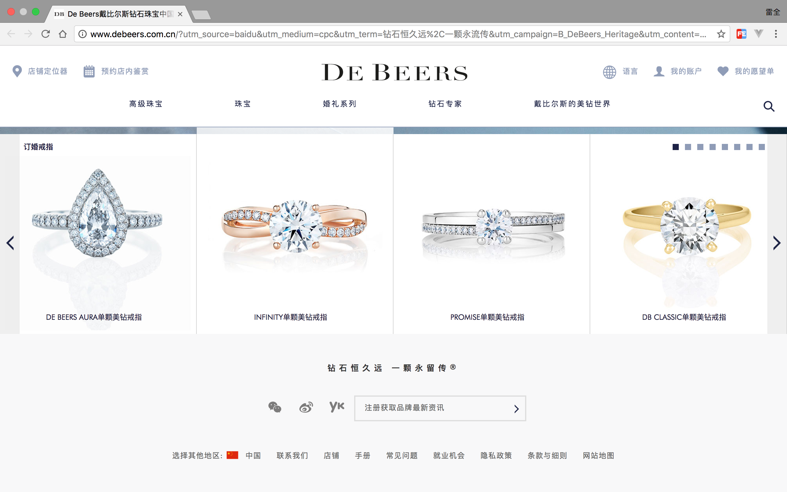
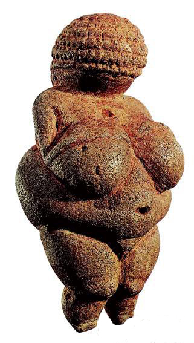
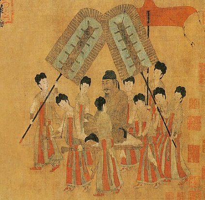
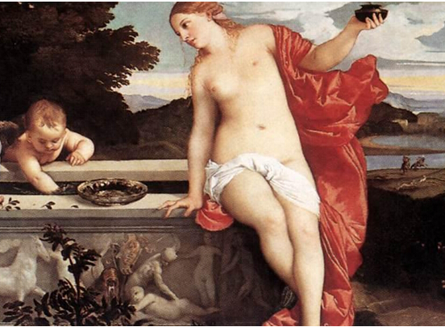

---
---
title: 整容整形是这个时代对女性最大程度的物化
date: 2017-04-30 00:17:06
category: 思考
tags:
  - 女性
  - 整容
  - 物化
  - 男女平等
  - 社会
---

昨天，我回了趟家，办了点事，今天回武汉了，地铁站的各式整容广告，让我决定要写一篇文章抨击一下了。我来武汉一个多月，可以说我在武汉地铁站电梯旁边看到最多的广告，就是整容广告了：抽脂瘦身，面部精雕，注射玻尿酸，隆胸，隆鼻，割双眼皮，截骨...让人目不暇接，眼花缭乱，并且略微带着一丝恐惧。

<!--more-->

我们先来看个无关的案例：

为什么结婚要买钻戒？因为钻戒象征爱情。为什么钻戒象征爱情？因为大家都认为钻戒象征爱情。为什么大家都觉得钻石象征爱情？因为“钻石恒久远，一颗永流传”。

我们来看看什么是真正的“钻石恒久远，一颗永流传”：

请注意注册商标的标志，如果你不清楚什么叫做注册商标，请点击[这里](http://chanquanzhishi.baike.com/article-52111.html)，查看互动百科对这个标志的解释，一言以蔽之：商标具有独占性。戴比尔斯这家公司注册了这句话作为商业标志，其他公司不能够使用，除非被授权，否则就会被告上法庭。

你每说一次这句话，就是在说一次这家公司的广告词。

因而，我们以为的钻戒作为爱情的象征，其实，只不过是商业公司的文案宣传效果所致。感兴趣的朋友，可以好好考据一下关于这句话和钻石的故事。当然，卖钻石，并不只有这一家公司。

但是，我认为，这个案例能够非常好的展示：商业可以创造文化，文化进而服务商业。

我们从整容广告的角度来推论一下：

这些整容医院为什么会打广告？因为整容赚钱。

为什么整容赚钱？因为有市场需求。

为什么有整容的市场需求？因为整容可以变美。

为什么觉得整容可以变美？因为电视，报纸，杂志，整容医院，社会文化宣传为那样子会美。

为什么他们要那么打广告宣传？因为他们要赚钱。

这是个完美的闭环。

在以前的中国，或者现在也是，文化是需要服务政治的；在资本主义国家和现在（某种程度也包括以前）的中国，文化是需要服务商业的。

文化是给非常广义的词，有很多内涵，和商业的关系也是非常复杂的。在和商业产生强联系的方面，除了前文例证中的爱情观，审美观，我还能想到很多领域或者方面，或者说和我们的生活已经浑然一体：电影工业，出版业，文创行业，旅游业，互联网，奢侈品，教育，情怀，理想，音乐，美食，电视.....我想，这所有领域，我们都是能找到商业是如何影响我们的文化心理认同的。

然而，今天我集中批判的是整容整形行业，因为，我认为他不仅是一个商业行为，更是对我们社会中的女性的极大摧残。

我们的批驳先从“以瘦为美”开始，这涉及到整容整形里面的抽脂瘦身等，并且，这可以说是女性现代审美规范的起源。

什么是抽脂？我们看一下，百度百科的解释：抽脂瘦身是利用器械通过皮肤小切口伸入皮下脂肪层将脂肪碎块吸出以达到吸收脂肪的目的方法，适用于体态整形。

我看了就疼，看到百度百科后面的危害，更疼，再随便网上看一篇专门论述其危害的，我已经心理发凉了，如果再在网上找找手术图片，更是吓人。我作为一个内心很强大的人，也难想象，决定做这个手术的人，是需要多大的勇气。

在远古时期，人们并不是以瘦为美，这个很好理解，因为这个时候，男女都是需要劳动的，体格强壮能够更好的劳动，并且对于女性来说可以更好的生育后代。我们看一下远古时期的雕塑：

后来，进入了封建社会，关于胖瘦的问题趋于正常化。唐代的审美是丰满类型的，因为融合了游牧民族的血缘和审美，所以对健硕的女性颇有好感。唐代女性画像也往往丰满雍容，我们看《步辇图》：

这个时候的欧洲，提倡的则是正常偏瘦的体态（也包括中国的某些时期），有时候也比较变态。著名的茜茜公主是这一时期瘦身美女的典型代表，身高达一米七二的皇后，腰围最细的时候仅有16英寸（约40厘米）。不过，那时候女性的裸体依然没有被严苛要求不能有一丝赘肉。我们看一下文艺复兴时期，画家提香的画作：

基本在现代以前，全世界关于胖瘦的审美，可以用基本比较正常来形容，不同时代，对胖瘦有过波动，唐代和欧洲。唐代只是偏丰满没什么可说，欧洲贵族女子则用紧身胸衣和束腰，并想尽办法勒紧自己的腰部，甚至有人因此勒断肋骨、造成内脏移位，这就非常变态了。不过值得注意的是，不管在东方还是西方，对体态的追求，大部分都停留在上层社会，也就是说，吃饱了饭，衣食无忧的阶层中。在下层社会，人们依然追求丰满、健硕的女性，因为干活有力气，也适合生育哺乳。

而到了现代，也就是最近几十年上百年，则是全民追瘦。我们简单看一下主要节点：

1906年，保罗·波烈为怀孕的妻子设计了一件不束腰的衣服，这件衣服造型简洁，线条流畅，直线型的外廓线彻底改变了传统的着装习惯，令人耳目一新。保罗·波烈忽然之间茅塞顿开：既然那种将身体分为上下两截的紧身胸衣既令人不适，又有损健康，何不将它彻底地放弃而代之以更为舒适的内衣？于是，一种以胸罩来强调基本体形的服装被设计出来，这些服装将原来放在腰部的支点移到了肩膀上，在整体的造型上形成一泻而下的流畅之势。当女人们一边体会着这种衣服的自由飘逸之感，一边兴奋得不知所措时，服装设计师们终于明白，紧身胸衣的历史走到了它的尽头。

1907年，法国设计师保罗·波烈“以自由的名义宣布束腰的式微和胸罩的兴起”，同时保罗·波烈提出了新的女装曲线观念，并呼唤女子从紧身胸衣的桎梏中解放出来，他设计的V领外衣在取代过去几乎没有任何空隙的紧口领子的同时，也影响了人们对内衣的看法。作为极具时尚影响力的设计师，他的设计概念被命名为“波烈线条”。也就是在1907年，美版《Vogue》出现了“胸罩”（brassiere）一词。

保罗·波列因为爱，为了怀孕妻子而发明了解除胸部肉体上的禁锢的衣服，后来演变成胸罩，这本来是一件很好的事情。这个发明解除了胸部肉体上的禁锢，却提高了人类追求身材完美比例的热情。而这一切，又在40年后，随着“比基尼”的兴起极速加剧。“比基尼”服装越来越贴身，让女性身体本来的线条更加暴露，由于不再借助束腰来塑造体形，女性为了迎合男性的眼光，只好努力减肥。

更倒霉的是，这段时间，正是大众传媒迅速发展的时期，时尚杂志、报纸蜂拥出现，审美的趋势第一次被大众传媒推波助澜、火上浇油。于是，瘦就是美，迅速而不容质疑地占据了女性审美的霸权地位。

以杂志为例：1953年10月，第一期《花花公子》杂志摆放在赫夫纳家厨房的餐桌上，封面介绍了挂历女郎玛丽莲·梦露。不过，出售的第一期封面上并没有标注出版日期，因为连赫夫纳自己也不知道还能不能有下一期，但第一期在美国卖出了50000份，足够收回成本和接着做下一期。一本在全球范围内流通的成人杂志就这样开始了它的故事。

因而，在商业的推动下，“以瘦为美”，迅速席卷全球。和“以瘦为美”一起裹胁而来的，还有对身材比例，大胸翘臀的S曲线，双眼皮，蛇精脸，翘鼻子...

随着科技越来越发达，以往的女性想要变美，可能通过锻炼来塑性，通过洁面和护肤来美白，通过有钢圈和海绵的胸罩来创造更美丽的胸部曲线，其实都无可厚非。

然而到了近些年，整容整形手术的兴起，则让这些爱美的女性仿佛看到了新的希望。在这些整形机构的利益驱使下，广告狂轰滥炸，媒体推波助澜，加上女性本来的爱美之心互相攀比，以及为了在寻找对象增加竞争力，担心自己长的不够美，考虑整容的女性越来越多，甚至很多女性被整容整坏了反复修补，整好了就更加接着整。我在网上搜到，这可能是一种病，叫做“幻丑症”，一种心理疾病。

我见过割双眼皮的女孩子，说实话，真不觉得双眼皮和单眼皮有什么区别；我见过胸部很大的女孩子，作为男性，我承认对女性的胸部是有向往的，但是胸太大真的看着很害怕，我觉得平胸也很可爱啊；整脸的我身边没有，可能是我不知道吧，我觉得去医院削自己的骨头，那是需要多大的勇气，一不小心就削坏了风险又那么高；隆鼻就更不用说了，我鼻子有点问题我都不愿意做手术，更别说往鼻子尖塞东西了。

我真的很佩服她们的勇敢，那种为了美愿意上刀山的勇敢，我是做不到的。然而，在佩服之余，我觉得她们或许有些东西需要思考一下。

如果是天生缺陷，去整成正常的可以理解，然而这样为了美，真的是美么？

不知道她们在看到整形整容广告的时候，有没有想过为什么会有这个广告？

即使有一千个原因，那么其中最重要的原因也是为了赚钱，盈利是企业的根本目的。

他们为了赚钱，所以他们创造了你以为美的文化；他们为了赚钱，把风险很高的整形整容手术宣传成简简单单的诊疗。

他们是不是为了赚钱，我想这些人在交手术费的时候是深有体会的，很多人是能够明白到这一点的。然而，不是所有人去思考，她们认为的美的文化是由谁创造，宣传的，谁定义的。

中国古代，女性有裹小脚的恶习，后来被推翻了；欧洲中世纪，有束腰的恶习，保罗·波列因为疼爱自己怀孕的妻子，不忍束胸，将它打破了。而今天，商业，通过塑造美的文化，却让很多人心甘情愿挨刀子去整容整形，不能不说，这是资本主义的原罪，这是我认为迄今为止对女性最大程度的物化。

微雕，让我想到雕塑，把人像雕塑一样雕来雕去；抽脂，一个人，体内的皮下脂肪，就这么被打碎，抽出；V整形，一个人的脸庞的骨头，用刀子削掉；在鼻子和胸部，塞入硅胶，冒着硅胶破裂的风险....这不是物化，这又是什么呢？

我无意批判那些去整形的女性，我认为某种程度上，她们是受害者，我为她们感到心疼，我批判的是整容整形机构背后的商业推动。当然，男性也有整容的，但是整体比例相较女性，除了明星，几乎可以忽略不计。如果真的需要整容，仔细考虑下再决定也不迟。

小时候，我对万恶的资本主义十分向往，因为我不喜欢社会主义的洗脑式教育；现在，随着我翻墙看到外面的更多的新闻，随着我思考更多的社会现象，让我确实发现，资本主义有很强的局限性的，万恶的资本主义，这一称号，或许不仅仅是一个意识形态的对立问题。

市场经济当然是要支持的，我认为自由的竞争，能发挥更高的效率。只是资本主义背后资本为王的逻辑，确实需要警惕和监管的，否则不良商人什么都做的出来的。可能是我受到了一些影响，比如开源思想或者人道主义性质的基金会的影响，在对比之下，对商业的质疑有时候会比较多。我觉得是好事儿，既要看到它的价值，也要看到它的局限，不要走极端，能够公正的看待事物最好了。

正如马克思在《资本论》中引用托·约·登宁的话：“一旦有适当的利润，资本就胆大起来。如果有10%的利润，它就保证到处被使用；有20%的利润，它就活跃起来；有50%的利润，它就铤而走险；为了100%的利润，它就敢践踏一切人间法律；有300%的利润，它就敢犯任何罪行，甚至冒绞首的危险。”

因而，为了赚钱，把武警二院承包给莆田系治死人算什么？为了赚钱告诉不懂事儿的小姑娘人流只要3分钟还不痛算什么？为了赚钱不宣传风险只宣传能变美忽悠人挨刀子整容算什么？

并且资本家还有更高明的手段，如果说违法犯罪容易被政府打击，被消费者唾弃，那就创造文化让人耳濡目染的接受。当然了，这只是部分的资本家和商人，很多企业家是非常值得尊敬的，尤其是大量的新式企业家：创造商品，提供服务，提供就业，极大的推进社会经济的发展，改善人们的生活，让这个世界更值得被期待。

我希望自己在社会中生活，能看到一些事情背后的利益；我也追求利益，我很缺钱，我会很努力的赚钱，但我不是钱的奴隶，而钱是我的工具。

---
#### 参考资料：
1.[中华人民共和国商标法实施条例（国务院令第651号）](http://www.gov.cn/zhengce/2014-04/30/content_2670953.htm)

2.[抽脂瘦身------百度百科](http://baike.baidu.com/link?url=pLN3MJS1ayovtnLY5rCbcWlCL8wQc-VqY3IK0mb3-JXSip09ckUY-g7VqYi0MgSODhWVORHv0e9uVoTBJF4wJPvFfbd4mPgGCAhwGEQvhnAtGLB0GnvivfsAQ5AD7DzQ)

3.[“以瘦为美”的审美观对当代女性身心健康的影响](http://xueshu.baidu.com/s?wd=paperuri%3A%28b243d28fa4ca74bb16948e1038289296%29&filter=sc_long_sign&tn=SE_xueshusource_2kduw22v&sc_vurl=http%3A%2F%2Fwww.doc88.com%2Fp-7106272521855.html&ie=utf-8&sc_us=1939387002661491541)

4.[人类是从什么时候开始以瘦为美的？](http://www.360doc.com/content/14/0712/11/14256335_393846012.shtml)

5.[保罗·波列------互动百科](http://www.baike.com/wiki/%E4%BF%9D%E7%BD%97%C2%B7%E6%B3%A2%E7%83%88)

6.[三点式------百度百科](http://baike.baidu.com/link?url=51q7lav61OlHu9PlIG3TxGy4zZzrCyvbBziN058e8CaVWFMo_yY1-0elLUVl8nxoguNKHlLC1FC10Pw_R3wjSdKF-0EBty0gXduHVDaNo7Ll7nFD9B4uQzOmDyEzZI0A)

7.[幻丑证------百度百科](http://baike.baidu.com/link?url=U6c2U3a_3QIHH1AUdm5W7u0IM_HytBLSGx2pc6tutnplYGoKP2LwhL8kWlUkqtLVzF5IeBtOa-K3jtMT6s6gDtc-ecC2Oz8v0mmLKfnhmvnVoSUPTIPJhWS3QW11A5sb)

8.[整容的坏处------知乎](https://www.zhihu.com/question/22370363)

9.[整容失败是一种怎样的体验？------知乎](https://www.zhihu.com/question/31947726)
