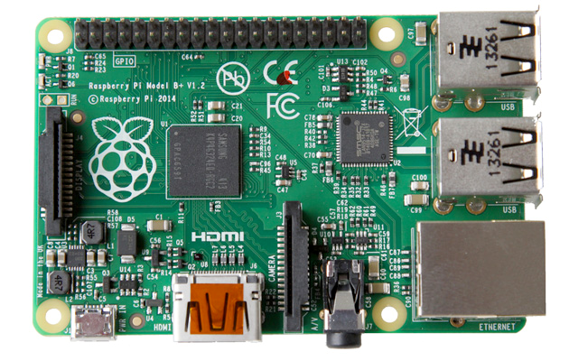

树莓派是非常棒的微型计算机，拥有数量众多的 GPIO 接口，利用这些接口，我们可以控制很多外围设备，做很多有趣的事情。

我们看下树莓派到手后应该如何启动、激活、以及连接到设备。

<!--more-->

1.参考官方教程，将系统写入 SD 卡
2.用网线将树莓派与路由器连接，接电开机
3.将笔记本和路由器的无线网连接
4.笔记本下载 ip scaner，扫描当前网络，就得到同一网络中树莓派的 IP
5.利用这个 IP，ssh 登录树莓派，开启 vnc server
6.接下来就可以利用 vnc viewer 连接树莓派查看桌面，我们发现桌面有很大一个的红色模样的水果，这就是真正的树莓派了。
7.每次扫描是很麻烦的，那么我们要将 IP固定下来，以后直接使用此 IP 登录即可。
8.固定方法：

```bash
sudo nano /etc/network/interfaces
```
2.修改为：

```bash
auto lo

iface lo inet loopback
iface eth0 inet static
address 192.168.1.200
netmask 255.255.255.0
gateway 192.168.1.1

auto wlan0
iface wlan0 inet static
address 192.168.1.200
netmask 255.255.255.0
gateway 192.168.1.1
wpa-ssid 要连接的wlan ssid（也就是网络名称）
wpa-passphrase wlan密码
wireless-channel 11
```

9.将 vnc server 添加到开机启动：
```bash
sudo nano  /etc/rc.local
```
在 exit 0前面加入：
```bash
tightvncserver -geometry 800x600 :1
```

这样，我们就给树莓派设置了无线网络，并且固定了一个 IP，下次只要开机，树莓派就会自动连接这个无线网了，我们就可以在自己电脑上登录树莓派了，就不需要网线了。注意，如果有一天登录不上了，请检查分配给树莓派的 IP，是不是被其他设备占用了。
