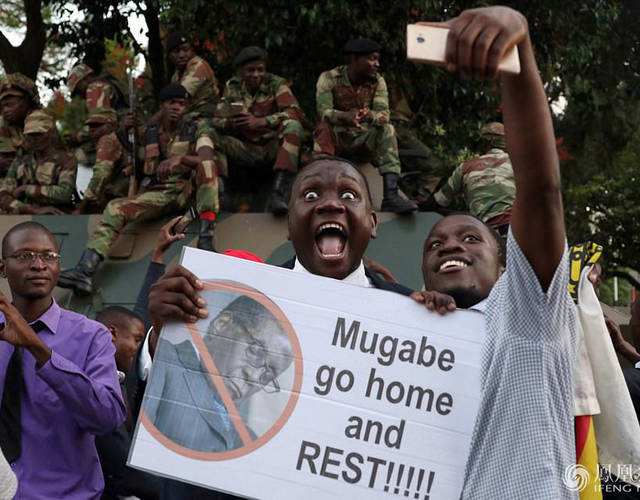
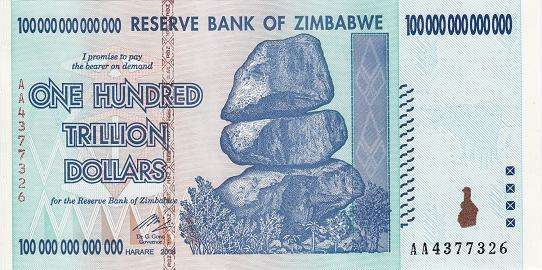

最近津巴布韦政局动乱，今早看到了津巴布韦人民走上街头庆祝其总统穆加贝的辞职的新闻，很是感慨，刚到公司，啃完面包赶快写个小文章评论一下。

##### “民众有多热爱领导人，或许就有多厌恶”

<!--more-->

穆加贝，津巴布韦的开国元勋，致力于祖国的独立和解放，与曼德拉一样，真正的民族英雄。然而，他又和曼德拉一样，在国家的解放和独立之后，带来了一系列的问题，尤其是政策不当而带来的经济问题，真是一对难兄难弟。

津巴布韦，曾经是非洲最富裕的农业大国和南部非洲第二大经济体，GDP年均增长率超过4%，并曾连续两年达到21%，因而是当时非洲经济平均增长率的3倍，且其粮食长年出口欧洲，这个国家曾被誉为“非洲面包篮”。可是如今，一切都变了，成为了一个政治动荡、经济内外交困的国度，社会问题充斥着整个国家的发展轨迹，如粮食匮乏，疾病横行，通胀率高居不下。

在这所有的问题中，大概通货膨胀是最出名的，出名到几乎每一个地球人都知道的地步，离谱到丢尽历史上央行的脸的地步。通货膨胀在历史上并不少见，德国的马克，民国的金圆券等等，但是津巴布韦通货到了新高度，甚至最后发行了100万亿的钞票，如图。

穆加贝和曼德拉一样，不善改革和治国，不仅发生了根本性错误，而且无力纠正，甚至昏招频出。南非的问题或许主要出在种族问题上，造成了黑人对白人的逆向歧视，进而造成严重问题；而津巴布韦，或许土地问题，是其政治和经济恶化的源动力。而且问题的关键在与政治制度：出了问题不要紧，做的不好的下台嘛，让能做好的人来，但是这两个国家并未有这样的体制，甚至没有这样的魄力，尤其是穆加贝，直到这次被迫辞去总统。如果没有这次政变，大概穆加贝还会扶持他妻子上台，这从他以及他妻子的公开言论可见一番：“我对穆加贝先生说，你应该让我接替你的位置”。

然而，随着事件的落幕，穆加贝和他妻子的政治生涯也走上街头，甚至面临被逮捕的命运。穆加贝辞职后，津巴布韦的部分人民，走上街头，手持标语和图片庆祝，更多图片在参考资料8，从图片中我们看到，庆祝的人群中，有军人、市民、议员等等。

那么曾经被热烈拥护的领袖，为什么又走到了这一步呢？除了本身的经济政策的失误，更深层次的原因我认为是制度：国家政策和罚站方向的失误，是正常的事情，否则我们泱泱中华五千年，也不会落到被人吊打的地步了；否则曾经的大英日不落帝国，也不会被美帝国主义抢走世界第一了。在这一点上，我认为美国的立国者，是非常的有远见，他们不寄托希望给国家领导人，甚至不寄托希望给联邦军队------这也是美国公民持枪权的来源之一，而是寄希望于制度。在美国的制度下，可以容忍出现问题，只是问题出现后，会被新的领导人和解决方案来迭代，当然是要付出代价的，但是大方向不会出现问题。而以穆加贝稳坐津巴布韦总统位置这么多年来看，津巴布韦是缺乏这样的制度的。

津巴布韦无疑是集权的，从穆加贝在津巴布韦的影响力和任职总统这么多年可见一番；从穆加贝对选举和舆论的操纵可见一番；从美国对津巴布韦的制裁、打击以及列入不受欢迎名单可见一番。

集权国家也不是一无是处，最重要的优势是：集中力量办大事。但是其问题也是显而易见：非常容易走向极端，因为缺乏了监督和制衡。这在人类历史上，可是有很多教训的，包括中国。

并且集权国家还有个典型的特征：对国家领导人异常的崇拜。比如朝鲜，我在和朝鲜人民的交谈中，是能明显感受到的。包括最近歌颂朝鲜领导人的歌曲出炉了，全国老女老少需要叫金正恩：爸爸？

为什么说这是集权国家的特征呢？因为在民主国家，当一位政治家作为总统候选人的时候，还没等任职总统的时候，谩骂和抨击就随之而来了。当选举结束，胜任总统之后，这些抨击并不会减少，只是人民会遵守法律规定，认可这个结果。

而在集权国家，国家领导人的任职情况可能之前没有任何动静，在宣布之后则需要集体给其尊敬。在任职期间，更是不能马虎，整个国家的宣传机器，都是为其服务的，别说谩骂和抨击了，非议或许都不会被允许。

因而在这样的压抑下，一旦解除了这种控制，部分人民的不满就会爆发出来，如题：民众有多热爱领导人，或许就有多厌恶。

---
#### 参考资料：

1.[罗伯特·加布里埃尔·穆加贝](https://baike.baidu.com/item/%E7%BD%97%E4%BC%AF%E7%89%B9%C2%B7%E5%8A%A0%E5%B8%83%E9%87%8C%E5%9F%83%E5%B0%94%C2%B7%E7%A9%86%E5%8A%A0%E8%B4%9D/2701734?fr=aladdin&fromid=3078235&fromtitle=%E7%A9%86%E5%8A%A0%E8%B4%9D)

2.[津巴布韦](https://baike.baidu.com/item/%E6%B4%A5%E5%B7%B4%E5%B8%83%E9%9F%A6/422924?fr=aladdin)

3.[津巴布韦问题探因](http://www.cqvip.com/qk/82189x/2005002/15641065.html)

4.[“废弃的货币”竟成最佳资产-津巴布韦100万亿大钞](http://forex.cngold.com.cn/20160516d1710n70296918.html)

5.[曼德拉执政后的南非出现了严重的社会问题或倒退吗](https://www.zhihu.com/question/22202198)

6.[新南非与津巴布韦的民族问题及
民族政策的比较](http://iwaas.cass.cn/webpic/web/cns/paper/uploadfiles/2/XYFZ201107005.pdf)

7.[穆加贝妻子表态：我已经做好准备接任总统](http://news.sina.com.cn/w/2017-11-07/doc-ifynmvuq9131978.shtml)

8.[津巴布韦总统宣布辞职后的街头](http://inews.ifeng.com/yidian/53473748/news.shtml?ch=ref_zbs_ydzx_news)

9.[张维为：邓小平早有预言——这个人（穆加贝）要自己碰！](http://www.guancha.cn/ZhangWeiWei/2017_11_16_435106.shtml)

10.[美国维持对津巴布韦实施制裁--中华人民共和国著津巴布韦共和国大使馆经济商务参赞处](http://zimbabwe.mofcom.gov.cn/article/jmxw/201309/20130900318338.shtml)
